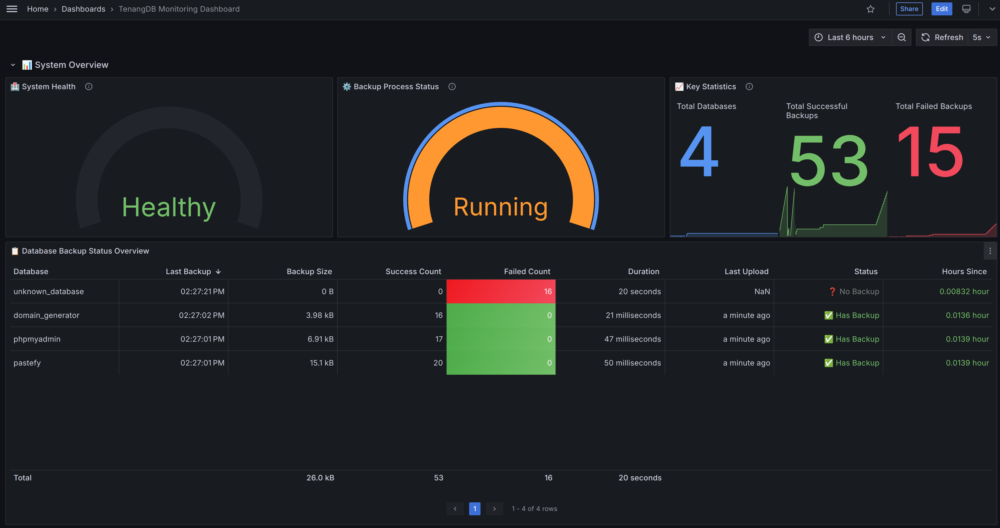

# 📊 TenangDB Grafana Dashboard

This folder contains the Grafana dashboard configuration for monitoring TenangDB backup operations.

## 🚀 Quick Import

### Method 1: Grafana UI (Recommended)
1. Open your Grafana web interface
2. Navigate to **Dashboards** → **Import**
3. Click **Upload JSON file**
4. Select `dashboard.json` from this folder
5. Configure your Prometheus data source
6. Click **Import**

### Method 2: API Import
```bash
curl -X POST \
  http://your-grafana-server:3000/api/dashboards/db \
  -H 'Content-Type: application/json' \
  -H 'Authorization: Bearer YOUR_API_KEY' \
  -d @grafana/dashboard.json
```

## 📋 Prerequisites

- ✅ Grafana server running
- ✅ Prometheus data source configured
- ✅ TenangDB metrics endpoint enabled (`http://localhost:8080/metrics`)

## ⚙️ Prometheus Configuration

Add this to your `prometheus.yml`:

```yaml
scrape_configs:
  - job_name: 'tenangdb'
    static_configs:
      - targets: ['localhost:8080']
    scrape_interval: 15s
    metrics_path: '/metrics'
```

## 📈 Dashboard Features

- **📊 System Overview** - Health status and uptime
- **💾 Backup Status** - Success/failure rates
- **🔄 Operations Timeline** - Backup activity over time
- **📈 Performance Metrics** - Duration and throughput
- **🗂️ Storage Usage** - Disk space and file counts
- **⚡ Real-time Monitoring** - Live metrics updates

## 🔧 Customization

The dashboard is fully customizable. You can:
- Modify time ranges and refresh intervals
- Add/remove panels
- Adjust thresholds and alerts
- Change visualization types

## 🎨 Preview



## 🆘 Troubleshooting

**Dashboard shows "No data":**
- Verify TenangDB metrics endpoint is accessible
- Check Prometheus is scraping the correct target
- Ensure data source is properly configured

**Metrics not updating:**
- Confirm TenangDB metrics are enabled in config
- Check Prometheus scrape interval
- Verify network connectivity

## 📝 Support

For issues with the dashboard:
- Check the main [INSTALL.md](../INSTALL.md) for TenangDB setup
- Open an issue on [GitHub](https://github.com/abdullahainun/tenangdb/issues)